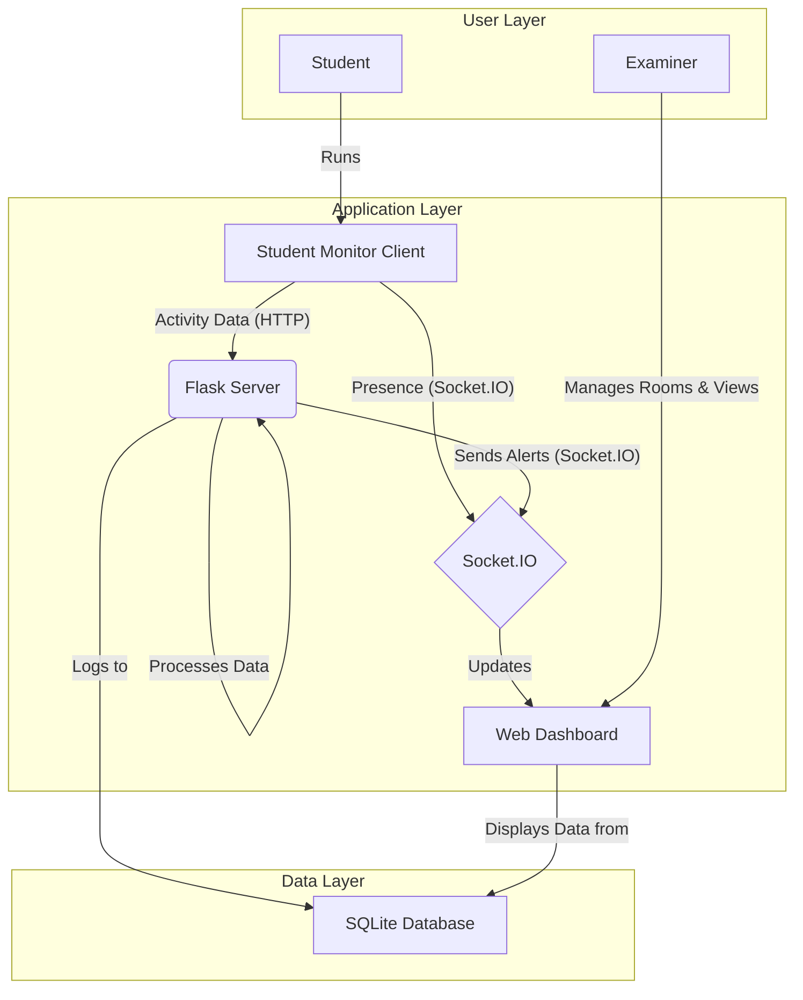

# ExamJudge: Real-Time Student Monitoring System

ExamJudge is a client-server application designed to help examiners monitor students during online assessments. It supports room-based monitoring, tracks student activity—keystrokes, clipboard usage, and application window titles—and sends real-time alerts to a centralized dashboard if any suspicious behavior is detected.

## Features

- **Multi-Room Monitoring**: Create unique rooms for different exams, each with its own dashboard.
- **Live Student Presence**: See a real-time list of all students connected to an exam room.
- **Real-Time Alerts**: The dashboard updates instantly with alerts for suspicious activities.
- **Keystroke Analysis**: Detects when students type keywords related to cheating (e.g., "chatgpt", "stackoverflow").
- **Clipboard Monitoring**: Flags copy-paste events, with special alerts for large pastes.
- **Suspicious Window Detection**: Alerts if a student opens a window with a title containing banned keywords.
- **Web-Based Dashboard**: A clean, modern web interface for examiners.
- **Simple Student Client**: A lightweight GUI application for students that is easy to run.

## System Architecture

The following diagram illustrates the flow of data between the components of the ExamJudge system.



## Use-Case Diagram

This diagram shows the interactions available to the main actors of the system.

```mermaid
graph LR
actor Student
actor Examiner

rectangle "ExamJudge System" {
  usecase "Start Monitoring" as UC1
  usecase "Send Activity Data" as UC2
  usecase "Stop Monitoring" as UC3
  
  usecase "Manage Exam Rooms" as UC4
  usecase "View Dashboard" as UC5
  usecase "View Student List" as UC6
  usecase "Monitor Live Alerts" as UC7
  usecase "View Pasted Content" as UC8
  usecase "View Historical Logs" as UC9

  Student -- UC1
  Student -- UC3
  UC1 ..> UC2 : <<includes>>

  Examiner -- UC4
  Examiner -- UC5
  Examiner -- UC9
  
  UC5 ..> UC6 : <<includes>>
  UC5 ..> UC7 : <<includes>>
  UC7 ..> UC8 : <<extends>>
}
```

## Project Structure

- **`server.py`**: The main Flask server that handles HTTP requests, manages Socket.IO connections, and processes incoming data from student monitors.
- **`student_monitor.py`**: The client-side application that students run. It monitors activity and sends data to the server.
- **`database.py`**: Contains functions for initializing the SQLite database and logging events.
- **`templates/`**: Holds the HTML files for the web dashboard and admin panel.
- **`monitoring.db`**: The SQLite database file where all monitoring data is stored.
- **`requirements.txt`**: A list of all Python dependencies required to run the project.
- **`credentials.json`**, **`token.json`**: Files used for Google API authentication (if integrated).

## Installation

Follow these steps to set up and run the project.

### Prerequisites

- Python 3.6+
- `pip` (Python package installer)

### 1. Clone the Repository

```bash
git clone <repository-url>
cd ExamJudge
```

### 2. Install Dependencies

Install the required Python libraries using `requirements.txt`.

```bash
pip install -r requirements.txt
```

## Usage Guide

### Step 1: Start the Server

Run the Flask server. This will start the backend that listens for data from the student monitors.

```bash
python server.py
```

The server will print the URLs for the admin panel and a template for the dashboard:
```
=====================================================
          SERVER IS STARTING
 🔑 Admin Panel URL: http://127.0.0.1:5000/admin
 🖥️  Dashboard URL: http://127.0.0.1:5000/dashboard/<room_id>
=====================================================
```
- First, go to the **Admin Panel** to create a unique `room_id` for your exam.
- Then, open the **Dashboard URL** in a web browser, replacing `<your_room_id>` with the ID you created.

### Step 2: Run the Student Monitor

On each student's computer, run the `student_monitor.py` script.

```bash
python student_monitor.py
```

This opens a small GUI application. The student must enter:
1.  **Exam Room ID**: The exact same room ID created by the examiner.
2.  **Student ID**: A unique identifier (e.g., "student_001").

### Step 3: Monitor the Dashboard

As students connect, their names will appear in the "Connected Students" list. Any suspicious activity will appear as a color-coded alert in real-time.

## Customization

- **Banned Keywords**: Modify the `BANNED_KEYWORDS` list in `student_monitor.py` and `CHEATING_KEYWORDS_REGEX` in `server.py`.
- **Server URL**: If the server is on a different machine, change the `SERVER_ADDRESS` in `student_monitor.py` to the server's IP address.
