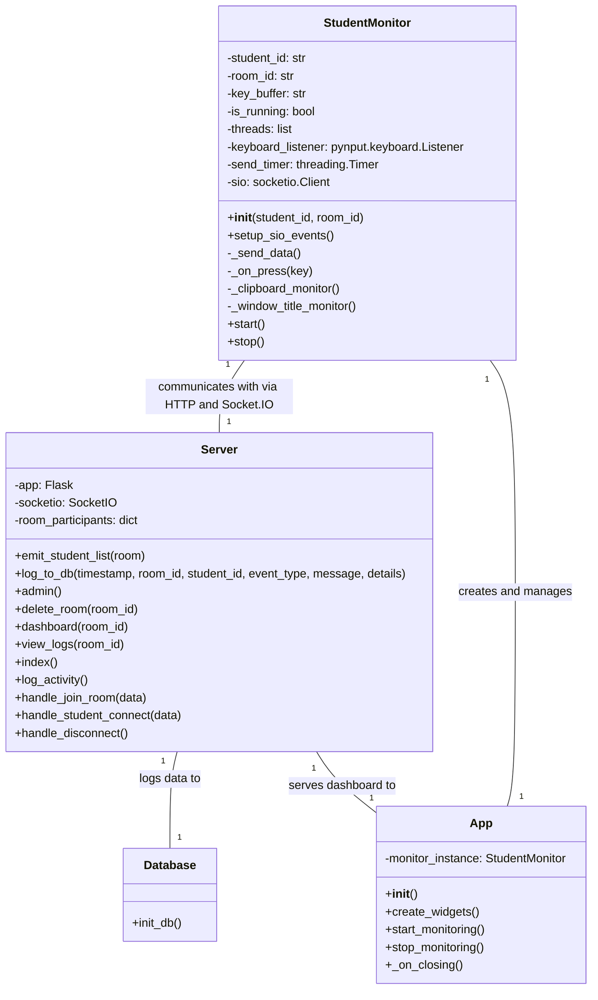

```mermaid
classDiagram
    class StudentMonitor {
        -student_id: str
        -room_id: str
        -key_buffer: str
        -is_running: bool
        -threads: list
        -keyboard_listener: pynput.keyboard.Listener
        -send_timer: threading.Timer
        -sio: socketio.Client
        +__init__(student_id, room_id)
        +setup_sio_events()
        -_send_data()
        -_on_press(key)
        -_clipboard_monitor()
        -_window_title_monitor()
        +start()
        +stop()
    }

    class App {
        -monitor_instance: StudentMonitor
        +__init__()
        +create_widgets()
        +start_monitoring()
        +stop_monitoring()
        +_on_closing()
    }

    class Server {
        -app: Flask
        -socketio: SocketIO
        -room_participants: dict
        +emit_student_list(room)
        +log_to_db(timestamp, room_id, student_id, event_type, message, details)
        +admin()
        +delete_room(room_id)
        +dashboard(room_id)
        +view_logs(room_id)
        +index()
        +log_activity()
        +handle_join_room(data)
        +handle_student_connect(data)
        +handle_disconnect()
    }

    class Database {
        +init_db()
    }

    App "1" -- "1" StudentMonitor : creates and manages
    StudentMonitor "1" -- "1" Server : communicates with via HTTP and Socket.IO
    Server "1" -- "1" Database : logs data to
    Server "1" -- "1" App : serves dashboard to
```