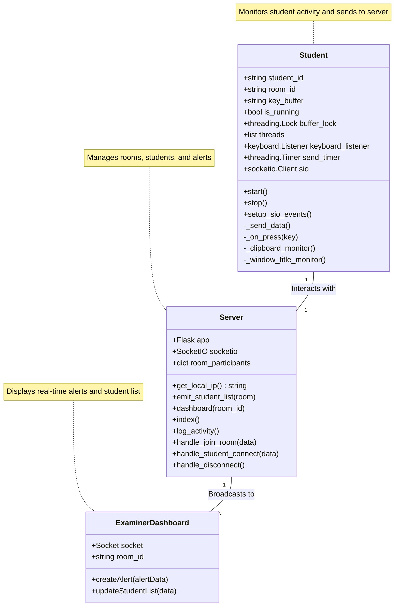

```mermaid
classDiagram
    class Student {
        +string student_id
        +string room_id
        +string key_buffer
        +bool is_running
        +threading.Lock buffer_lock
        +list threads
        +keyboard.Listener keyboard_listener
        +threading.Timer send_timer
        +socketio.Client sio
        +start()
        +stop()
        +setup_sio_events()
        -_send_data()
        -_on_press(key)
        -_clipboard_monitor()
        -_window_title_monitor()
    }

    class Server {
        +Flask app
        +SocketIO socketio
        +dict room_participants
        +get_local_ip() string
        +emit_student_list(room)
        +dashboard(room_id)
        +index()
        +log_activity()
        +handle_join_room(data)
        +handle_student_connect(data)
        +handle_disconnect()
    }

    class ExaminerDashboard {
        +Socket socket
        +string room_id
        +createAlert(alertData)
        +updateStudentList(data)
    }

    Student "1" -- "1" Server : Interacts with
    Server "1" -- "N" ExaminerDashboard : Broadcasts to

    note for Student "Monitors student activity and sends to server"
    note for Server "Manages rooms, students, and alerts"
    note for ExaminerDashboard "Displays real-time alerts and student list"
```