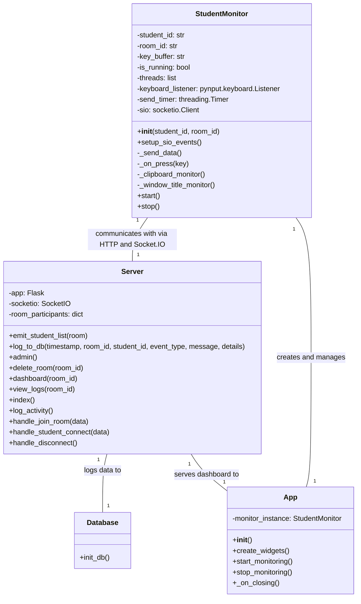

# ExamJudge: A Real-Time Student Monitoring System for Online Assessments

---

## 1. The Challenge of Maintaining Academic Integrity in Online Assessments

The proliferation of online learning has been a paradigm shift in education, offering flexibility and accessibility to students worldwide. However, this shift has also brought significant challenges, none more critical than ensuring academic integrity during online assessments. When students are physically present in an examination hall, proctors can directly observe their behavior, preventing the use of unauthorized materials or communication. In a remote setting, this direct oversight is lost, opening the door to a wide range of academic dishonesty.

### 1.1 The Problem Space: A Landscape of Digital Cheating

The methods students can employ to cheat in online exams are as varied as they are ingenious. The most common and difficult to detect methods involve the use of digital resources. A student can, for instance, have a web browser open in the background to search for answers on Google, Stack Overflow, or other online forums. They can use messaging applications like WhatsApp, Telegram, or Discord to communicate with other students, sharing answers and collaborating in real-time. They can also prepare answers in advance and simply copy and paste them into the exam interface.

Consider a few concrete examples:

*   **Scenario 1: The "Quick Google Search"**: A student taking a multiple-choice quiz encounters a question they don't know the answer to. They quickly switch to a web browser, type in the question, and find the answer on a website like Wikipedia or a specialized forum. They then switch back to the exam and select the correct answer. This entire process can take less than a minute, making it very difficult to detect without specialized monitoring.

*   **Scenario 2: The "Copy-Paste"**: In an essay-based exam, a student might have pre-written answers stored in a text file. When the corresponding question appears, they simply copy the answer and paste it into the exam form. This not only constitutes plagiarism but also completely bypasses the student's own understanding of the topic.

*   **Scenario 3: The "Collaborative Cheating"**: A group of students taking the same exam can create a private chat group. When a new question appears, one student can post it in the group, and the others can work together to find the answer. This turns an individual assessment into a team effort, undermining the very purpose of the exam.

### 1.2 The Limitations of Traditional Proctoring Solutions

To combat these issues, a variety of online proctoring solutions have been developed. Many of these rely on webcam and microphone surveillance, with some even using AI to detect suspicious behavior like a student looking away from the screen for too long. However, these solutions have several drawbacks:

*   **Intrusiveness**: Constant video and audio surveillance can be highly intrusive and create a stressful and uncomfortable environment for the student. Many students feel that this is a violation of their privacy.

*   **Cost**: Commercial proctoring services can be expensive, with costs often passed on to the students. This can create a financial barrier for some, making education less accessible.

*   **Technical Requirements**: These solutions often have strict technical requirements, such as a high-speed internet connection and a high-quality webcam. Students who do not have access to these resources may be unable to take the exam.

*   **False Positives**: AI-based systems can be prone to false positives, flagging innocent behavior as suspicious. For example, a student who is simply thinking deeply about a question might be flagged for looking away from the screen.

### 1.3 Our Proposed Solution: ExamJudge

It is in this context that we developed ExamJudge, a real-time student monitoring system designed to be a lightweight, less intrusive, and more focused alternative to traditional proctoring solutions. Instead of relying on video and audio surveillance, ExamJudge focuses on monitoring the direct indicators of digital cheating: keystrokes, clipboard usage, and application window titles. By flagging suspicious activity in real-time, ExamJudge provides examiners with the information they need to intervene and ensure a fair testing environment for all.

The core philosophy behind ExamJudge is that by making students aware that their on-screen activity is being monitored, we can deter them from attempting to cheat in the first place. And for those who do attempt to cheat, the real-time alerts provide examiners with concrete evidence to support their interventions.

---

## 2. The Architecture of ExamJudge

ExamJudge is built on a classic client-server architecture, which is well-suited for a system that needs to collect data from multiple clients and process it in a centralized location. The system is composed of three main components: the Student Monitor, the Server, and the Examiner Dashboard.



### 2.1 The Student Monitor

The Student Monitor is a desktop application that runs on the student's computer. It is responsible for capturing the student's activity and sending it to the server. The monitor is designed to be lightweight and easy to use, with a simple GUI that allows the student to start and stop the monitoring process.

The monitor captures three types of activity:

*   **Keystrokes**: The monitor records all keystrokes made by the student. This allows the system to detect when a student types a suspicious keyword, such as "chatgpt" or "stackoverflow".

*   **Clipboard Usage**: The monitor tracks the content of the clipboard. When the student copies or pastes text, the monitor sends the content to the server. This allows the system to detect when a student pastes a large amount of text, which could indicate that they are using a pre-written answer.

*   **Application Window Titles**: The monitor records the title of the active window. This allows the system to detect when a student switches to a forbidden application, such as a web browser or a messaging app.

### 2.2 The Server

The Server is the central component of the ExamJudge system. It is a Flask application that runs on a central server and is responsible for receiving data from the student monitors, processing it, and sending alerts to the Examiner Dashboard. The server has several key responsibilities:

*   **Data Reception**: The server has an HTTP endpoint that receives data from the student monitors. The data is sent as a JSON payload, which includes the student's ID, the room ID, and the activity data.

*   **Data Processing**: The server processes the activity data to detect suspicious behavior. For example, it checks keystrokes for banned keywords, and it checks the length of pasted text to see if it exceeds a certain threshold.

*   **Alert Generation**: When the server detects suspicious behavior, it generates an alert. The alert includes the student's ID, the type of suspicious activity, and any relevant details (e.g., the keyword that was typed or the content that was pasted).

*   **Real-Time Communication**: The server uses Flask-SocketIO to send real-time alerts to the Examiner Dashboard. This ensures that the examiner is notified immediately when a student engages in suspicious behavior.

*   **Database Logging**: The server logs all suspicious activity to an SQLite database. This provides a permanent record of the exam session, which can be reviewed later if necessary.

### 2.3 The Examiner Dashboard

The Examiner Dashboard is a web-based interface that allows the examiner to monitor the students in real-time. The dashboard has two main features:

*   **Real-Time Alerts**: The dashboard displays a real-time feed of alerts generated by the server. The alerts are color-coded to indicate their severity, with red alerts for high-priority events (e.g., pasting a large amount of text) and orange alerts for lower-priority events (e.g., typing a suspicious keyword).

*   **Connected Students**: The dashboard displays a list of all students who are currently connected to the exam room. This allows the examiner to see at a glance who is participating in the exam.

The dashboard is a single-page application that uses JavaScript and Socket.IO to communicate with the server. This allows the dashboard to update in real-time without the need for page reloads.

---

## 3. The Implementation of ExamJudge

The implementation of ExamJudge is divided into three main parts: the Student Monitor, the Server, and the Examiner Dashboard. In this section, we will describe the implementation of each of these components in detail.

### 3.1 The Student Monitor

The Student Monitor is a Python application that uses the Tkinter library for its GUI. The core logic of the monitor is contained in the `StudentMonitor` class, which is responsible for capturing the student's activity and sending it to the server.

The monitoring process is run in a separate thread to avoid blocking the GUI. The `StudentMonitor` class uses three separate threads to monitor keystrokes, clipboard usage, and application window titles concurrently.

#### 3.1.1 Keystroke Monitoring

Keystroke monitoring is implemented using the `pynput` library. The `pynput` library provides a `keyboard.Listener` class that can be used to listen for keyboard events. When a key is pressed, the `_on_press` method of the `StudentMonitor` class is called. This method appends the character to a buffer, which is then sent to the server at regular intervals.

```python
def _on_press(self, key):
    with self.buffer_lock:
        try: self.key_buffer += key.char
        except AttributeError: self.key_buffer += f'[{str(key).split(".")[-1].upper()}]'
    return self.is_running
```

#### 3.1.2 Clipboard Monitoring

Clipboard monitoring is implemented using the `pyperclip` library. The `_clipboard_monitor` method of the `StudentMonitor` class runs in a loop, checking the content of the clipboard every two seconds. If the content of the clipboard has changed, the new content is sent to the server.

```python
def _clipboard_monitor(self):
    try: previous_clipboard = pyperclip.paste()
    except pyperclip.PyperclipException: return
    while self.is_running:
        try:
            pasted_data = pyperclip.paste()
            if pasted_data and pasted_data != previous_clipboard:
                previous_clipboard = pasted_data
                payload = { 'student_id': self.student_id, 'room_id': self.room_id, 'pasted_content': pasted_data, 'event_type': 'paste' }
                requests.post(SERVER_URL, json=payload, timeout=5)
        except (pyperclip.PyperclipException, requests.exceptions.RequestException): pass
        time.sleep(2)
```

#### 3.1.3 Window Title Monitoring

Window title monitoring is implemented using the `pygetwindow` library. The `_window_title_monitor` method of the `StudentMonitor` class runs in a loop, checking the title of the active window every second. If the title of the active window has changed and contains a banned keyword, the new title is sent to the server.

```python
def _window_title_monitor(self):
    last_title = ""
    while self.is_running:
        try:
            active_window = gw.getActiveWindow()
            if active_window and active_window.title:
                title = active_window.title.lower()
                if title and title != last_title:
                    last_title = title
                    for keyword in BANNED_KEYWORDS:
                        if keyword in title:
                            payload = { 'student_id': self.student_id, 'room_id': self.room_id, 'event_type': 'window_title', 'title': active_window.title }
                            requests.post(SERVER_URL, json=payload, timeout=5)
                            break
        except Exception: pass
        time.sleep(1)
```

### 3.2 The Server

The Server is a Flask application that uses Flask-SocketIO for real-time communication. The server has a single HTTP endpoint, `/log`, which receives activity data from the student monitors. The server also has several Socket.IO event handlers for managing the connection with the Examiner Dashboard.

The `/log` endpoint is the core of the server's data processing logic. This endpoint receives a JSON payload from the student monitor, which includes the student's ID, the room ID, and the activity data. The endpoint then processes the data to detect suspicious behavior.

```python
@app.route('/log', methods=['POST'])
def log_activity():
    data = request.get_json()
    if not data: return jsonify({"status": "error", "message": "Invalid data"}), 400
    student_id = data.get('student_id', 'Unknown Student')
    room_id = data.get('room_id', 'default_room')
    event_type = data.get('event_type')
    timestamp = datetime.now().strftime('%Y-%m-%d %H:%M:%S')
    alert_data = {'student_id': student_id, 'timestamp': timestamp.split(" ")[1]}
    if event_type == 'keystroke':
        keystrokes = data.get('keystrokes', '')
        found_keywords = CHEATING_KEYWORDS_REGEX.findall(keystrokes)
        for keyword in set(found_keywords):
            message = f'Suspicious keyword "{keyword}" typed.'
            alert_data.update({'type': 'Keyword Detected', 'message': f'Suspicious keyword "<strong>{keyword}</strong>" typed.', 'color': 'bg-orange-100'})
            socketio.emit('new_alert', alert_data, room=room_id)
            log_to_db(timestamp, room_id, student_id, 'Keyword Detected', message, details=f"Keyword: {keyword}")
    elif event_type == 'paste':
        pasted_content = data.get('pasted_content', '')
        pasted_length = len(pasted_content)
        is_high_char = pasted_length > HIGH_CHAR_PASTE_THRESHOLD
        alert_type = 'High Character Paste' if is_high_char else 'Paste Detected'
        message = f'A large amount of text ({pasted_length} chars) was pasted.' if is_high_char else f'Pasted {pasted_length} characters.'
        alert_data.update({'type': alert_type, 'message': message, 'color': 'bg-red-200' if is_high_char else 'bg-red-100', 'paste_content': pasted_content})
        socketio.emit('new_alert', alert_data, room=room_id)
        log_to_db(timestamp, room_id, student_id, alert_type, message, details=pasted_content)
    elif event_type == 'window_title':
        title = data.get('title', '')
        message = f'Active window title contains banned keyword: {title}'
        alert_data.update({'type': 'Suspicious Window', 'message': f'Active window title: <strong>{title}</strong>', 'color': 'bg-blue-100'})
        socketio.emit('new_alert', alert_data, room=room_id)
        log_to_db(timestamp, room_id, student_id, 'Suspicious Window', message, details=f"Window Title: {title}")
    return jsonify({"status": "success"}), 200
```

### 3.3 The Examiner Dashboard

The Examiner Dashboard is a single-page web application that is built with HTML, CSS, and JavaScript. The dashboard uses the Socket.IO client library to connect to the server and receive real-time alerts.

When the dashboard loads, it prompts the examiner to enter a room ID. It then connects to the server and joins the corresponding room. When the server emits a `new_alert` event, the dashboard receives the alert and dynamically adds it to the alert feed. The dashboard also receives `update_student_list` events from the server, which it uses to update the list of connected students.

The use of Socket.IO for real-time communication is the key to the dashboard's effectiveness. It ensures that the examiner is notified immediately when a student engages in suspicious behavior, allowing them to intervene in a timely manner.

---

## 4. Evaluating the Effectiveness of ExamJudge

The ultimate measure of ExamJudge's success is its ability to deter and detect cheating in online assessments. In this section, we will evaluate the effectiveness of the system by considering how it would handle the concrete cheating scenarios we described in Section 1.

### 4.1 Scenario 1: The "Quick Google Search"

In this scenario, a student switches to a web browser to search for an answer. ExamJudge would detect this in two ways:

1.  **Window Title Monitoring**: As soon as the student switches to the web browser, the window title monitor would detect the change in the active window title. If the title contains a banned keyword, such as "Google" or "Stack Overflow", the system would immediately generate a "Suspicious Window" alert.

2.  **Keystroke Monitoring**: When the student types their search query into the search bar, the keystroke monitor would capture the keystrokes. If the query contains any banned keywords, the system would generate a "Keyword Detected" alert.

By combining these two monitoring methods, ExamJudge provides a robust defense against this type of cheating. The examiner would be notified as soon as the student opens the web browser, and they would also be able to see what the student is searching for.

### 4.2 Scenario 2: The "Copy-Paste"

In this scenario, a student copies a pre-written answer and pastes it into the exam form. ExamJudge would detect this using its clipboard monitoring feature.

When the student pastes the text, the clipboard monitor would send the pasted content to the server. The server would then check the length of the pasted text. If the length exceeds a certain threshold (e.g., 100 characters), the server would generate a "High Character Paste" alert. This would immediately notify the examiner that the student has pasted a large amount of text, which is a strong indicator of cheating.

The examiner could then review the pasted content to determine if it is plagiarized. This provides the examiner with concrete evidence to support any disciplinary action they might choose to take.

### 4.3 Scenario 3: The "Collaborative Cheating"

In this scenario, a group of students use a messaging application to collaborate during the exam. ExamJudge would detect this in a similar way to the "Quick Google Search" scenario.

If the students are using a desktop messaging application, the window title monitor would detect when they switch to the application. If the title of the application contains a banned keyword (e.g., "WhatsApp", "Telegram"), the system would generate a "Suspicious Window" alert.

If the students are using a web-based messaging application, the system would detect this in the same way it detects a Google search. The window title monitor would detect the change in the active window title, and the keystroke monitor would capture any messages that are typed.

### 4.4 Limitations and Future Work

While ExamJudge is an effective tool for deterring and detecting many common forms of digital cheating, it is not without its limitations. The system can be bypassed by a determined student. For example, a student could use a second computer or a mobile device to search for answers, which would not be detected by the monitor running on their primary computer.

Future work on the project could focus on addressing these limitations. For example, the system could be extended to include webcam and microphone surveillance, which would make it more difficult for students to use a second device. However, this would also make the system more intrusive, which would go against the original design philosophy.

A more promising area for future work would be to develop more sophisticated methods for detecting suspicious behavior. For example, the system could use natural language processing to analyze the student's keystrokes and detect changes in their writing style, which could indicate that they are receiving help from someone else.

---

## 5. Conclusion

In conclusion, ExamJudge is a powerful and effective tool for maintaining academic integrity in online assessments. By focusing on the direct indicators of digital cheating, it provides a lightweight and less intrusive alternative to traditional proctoring solutions. The system's real-time alerts and comprehensive logging provide examiners with the information they need to deter and detect cheating, ensuring a fair testing environment for all.

While the system has its limitations, it represents a significant step forward in the field of online proctoring. With its modular architecture and extensible design, ExamJudge provides a solid foundation for future development and innovation in the ongoing effort to ensure the integrity of online education.
